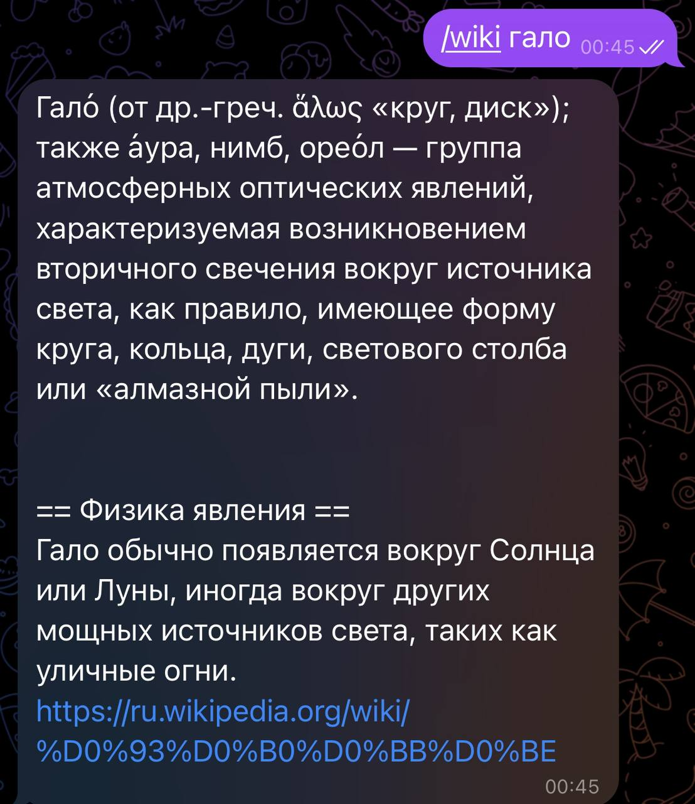

# Enteros Bot


## Use Cases

### Morning


### Instagram


### Wiki


### Boobs


## Python Libs Used


```properties

python-telegram-bot==21.6
nltk==3.9.1
pytest==8.3.3
pymorphy2==0.9.1
schedule==1.2.2
wikipedia==1.4.0
translators==5.9.3

```

For russian language lemminization: [pymorphy2](https://pymorphy2.readthedocs.io/en/stable/_modules/pymorphy2/analyzer.html)

### CI/CD 

Github actions is used [deploy.yml](.github/workflows/deploy.yml)

